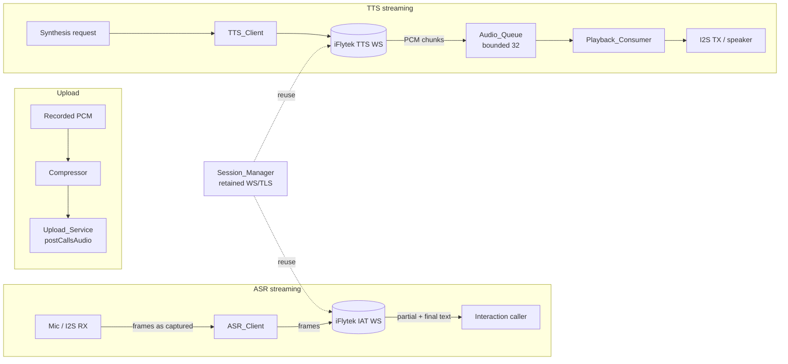

# Design Document

## Overview

This design optimizes the end-to-end voice interaction latency of the ESP32-based child help device. Today the pipeline is fully serial and batch-oriented: TTS synthesizes an entire clip into memory before playback starts, and ASR records a full 6 s window before connecting and uploading the whole clip. A round trip reaches ~30 s.

The design converts the two heavy stages (TTS and ASR) from **batch** to **streaming**, adds **session reuse** to eliminate per-round handshakes, adds **audio compression** on the upload path, and fixes the **first-attempt empty ASR result** caused by codec/I2S warm-up. HTTP Date-based time sync is already optimized and is out of scope.

The core architectural lever is a **bounded producer/consumer queue (`Audio_Queue`)** that decouples the network callback thread from the I2S playback thread, so playback can begin as soon as the first chunk arrives instead of after the last. The ASR path is inverted symmetrically: frames are sent to iFlytek as they are captured rather than after recording ends.

Target outcome: Round_Trip_Latency ≤ 12 s (Req 6.4), TTS First_Packet_Latency ≤ 1500 ms (Req 1.3), ASR Recognition_Tail_Latency ≤ 2000 ms (Req 2.4).

### Scope of source changes

- `main/tts_xfyun.c/.h` — streaming synthesis + playback (new streaming entry point)
- `main/asr_xfyun.c/.h` — streaming recognition (concurrent connect + frame send)
- `main/audio_driver.c/.h` — `Audio_Queue`, streaming playback consumer, warm-up discard
- `main/api_service.c` — compressed upload in `api_post_calls_audio_mem` / `postCallsAudio`
- New session-reuse helper (`Session_Manager`) shared by TTS and ASR clients
- Out of scope: `main/time_sync.c`

## Architecture

The optimized pipeline runs the network and audio-hardware stages concurrently instead of sequentially.



Key architectural decisions:

1. **Decoupling via a bounded queue.** The TTS WebSocket callback (producer) and the `Playback_Consumer` (consumer) run on separate threads and communicate through `Audio_Queue`. This is what enables playback to start on the first chunk (Req 1.1, 1.2, 1.4) while bounding memory to 32 chunks with backpressure (Req 1.12).
2. **Concurrent connect + capture for ASR.** The IAT WebSocket connection is established in parallel with the start of audio capture so the handshake overlaps recording rather than adding to tail latency (Req 2.1, 2.2).
3. **Connection retention across rounds.** `Session_Manager` keeps healthy WebSocket/TLS connections open between rounds, keyed by service type, with health and idle-timeout checks and a single retry-on-reuse-failure path (Req 3).
4. **Compression at the upload boundary only.** ASR streaming and upload are independent paths; compression is applied only to the archived recording sent to the backend, not to the live ASR frames (Req 4).

## Components and Interfaces

### TTS_Client (`tts_xfyun.c`)
Responsibilities: connect to iFlytek TTS (via `Session_Manager`), receive audio chunks in the WS callback, decode to 16 kHz/16-bit/mono PCM, and enqueue chunks into `Audio_Queue` as they arrive. Signals completion when the final chunk (status = end) is enqueued, and surfaces synthesis errors.

New streaming entry point (proposed):
```c
// Starts streaming synthesis; returns after playback completes or errors.
esp_err_t tts_xfyun_speak_stream(const char *text);
```
Behavior notes: on error before any chunk is enqueued, abort and return failure (Req 1.7); on error after chunks are enqueued, let the consumer drain what it has (Req 1.8); return to a ready state without an explicit error-clear step (Req 1.9). Existing batch functions remain for compatibility.

### Playback_Consumer (in `audio_driver.c`)
Responsibilities: dequeue PCM chunks from `Audio_Queue` and write them to I2S TX via the existing `audio_play_pcm_begin/write/end` path. Starts on the first available chunk (Req 1.2), keeps playing while more arrive (Req 1.4), waits up to 3000 ms on an empty-but-not-finished queue (Req 1.5), and aborts with an error if that timeout elapses (Req 1.11). Drains fully then releases resources on completion (Req 1.6). Honors `audio_play_abort()` within 200 ms (Req 6.3).

### Audio_Queue (in `audio_driver.c`)
A bounded FreeRTOS queue / ring buffer of PCM chunk descriptors, capacity 32 (Req 1.12). Producer blocks when full rather than dropping chunks. Carries a per-chunk "final" flag so the consumer knows when the stream is complete (Req 1.6).

```c
typedef struct {
    int16_t *pcm;       // 16 kHz/16-bit/mono samples (owned by queue)
    size_t   num_samples;
    bool     is_final;  // marks end-of-stream chunk
} audio_chunk_t;
```

### ASR_Client (`asr_xfyun.c`)
Responsibilities: establish the IAT WebSocket concurrently with capture (Req 2.1, 2.8 timeout 10000 ms), send each captured frame as it becomes available in 16 kHz/16-bit/mono PCM (Req 2.2, 2.7), send an end-of-stream final frame when the window ends (Req 2.3), and deliver the final UTF-8 transcript (Req 2.6) within 2000 ms tail latency (Req 2.4) / 15000 ms hard timeout (Req 2.9). On frame-send failure, stop, discard partial text, and error out (Req 2.5). Preserves transcript equality with the batch pipeline for identical input (Req 6.2).

New streaming entry point (proposed):
```c
// Streams frames while recording; returns final transcript.
esp_err_t asr_xfyun_recognize_stream(uint32_t window_sec,
                                      char *out_text, size_t out_text_size);
```

### Session_Manager (new helper, shared)
Responsibilities: retain healthy WS/TLS connections per service type after a successful round (Req 3.1), reuse when open + error-free + within idle timeout (Req 3.2, ≤ 50 ms setup Req 3.5), discard + reconnect otherwise (Req 3.3), retry-once on first-exchange reuse failure with an error log (Req 3.4), and close all retained connections within 1000 ms at session end (Req 3.6).

```c
typedef enum { SVC_TTS, SVC_ASR } svc_type_t;
esp_err_t session_acquire(svc_type_t type, ws_handle_t *out_ws); // reuse or connect
void      session_release(svc_type_t type, ws_handle_t ws, bool healthy);
void      session_close_all(void);
```

### Upload_Service (`api_service.c` — `api_post_calls_audio_mem`)
Responsibilities: compress the completed recording before upload (Req 4.1) to ≤ 20% of raw PCM size (Req 4.2), attach encoding-format metadata (Req 4.3), preserve 16 kHz/mono intelligibility (Req 4.5), and complete upload within 2000 ms under baseline uplink (Req 4.6). On compression failure, send nothing, keep the original recording, and return an error (Req 4.4).

### Audio_Driver warm-up discard (`audio_driver.c`)
On the first listen attempt, discard only the codec/I2S warm-up samples (≤ 50 ms) then retain valid speech within 50 ms of recording start, capturing the full configurable window (1–10 s) (Req 5.1, 5.2). This fixes the first-attempt empty result (Req 5.3); empty results are reported to the caller within 500 ms with interaction state preserved for retry (Req 5.4).

## Data Models

**PCM audio format (invariant across the pipeline):** 16 kHz sample rate, 16-bit signed samples, mono. Preserved for both TTS output (Req 1.10) and ASR input (Req 2.7), and for the decoded compressed upload (Req 4.5).

**`audio_chunk_t`** — unit of transfer through `Audio_Queue` (see above).

**Compressed upload payload** — compressed audio bytes plus encoding-format metadata:
```c
typedef struct {
    const char *encoding;   // e.g. "speex", "opus", "adpcm"
    uint32_t    sample_rate;// 16000
    uint8_t     channels;   // 1
    uint8_t    *data;
    size_t      data_len;
} compressed_audio_t;
```

**Session entry** — retained connection state held by `Session_Manager`:
```c
typedef struct {
    ws_handle_t ws;
    bool        open;
    bool        had_error;
    int64_t     last_used_us; // for idle-timeout check
} session_entry_t;
```

**Latency metrics** (measurement points, not stored structures): First_Packet_Latency (request → first I2S write), Recognition_Tail_Latency (window end → final transcript), Round_Trip_Latency (end of user speech → first audible sample).

## Correctness Properties

*A property is a characteristic or behavior that should hold true across all valid executions of a system — a formal statement about what the system should do. Properties bridge human-readable specifications and machine-verifiable correctness guarantees.*

This is embedded firmware, so most acceptance criteria are latency targets, real-time hardware I/O, or external-service behavior and are covered by integration/example tests (see Testing Strategy). The properties below capture the pure, input-varying logic that benefits from property-based testing: the bounded `Audio_Queue`, the `Session_Manager` reuse decision, the compression transform, and the recording sample-count computation. These should be tested against a host build of that logic (extracted/pure functions), independent of the ESP32 hardware.

### Property 1: Audio_Queue is a bounded, lossless, FIFO producer/consumer buffer

*For any* sequence of PCM chunks ending in a final-marked chunk, and *for any* interleaving of enqueue and dequeue operations, the queue occupancy SHALL always remain within [0, 32], every enqueued chunk SHALL be dequeued exactly once in the same (FIFO) order it was enqueued, no chunk SHALL be dropped, and consumption SHALL terminate exactly at the final-marked chunk.

**Validates: Requirements 1.6, 1.12**

### Property 2: Session reuse decision is a pure function of connection health

*For any* retained connection state (open flag, transport-error flag, idle duration), the `Session_Manager` SHALL reuse the connection if and only if it is open AND has no reported transport error AND its idle duration is strictly less than the iFlytek idle timeout; otherwise it SHALL discard and establish a new connection.

**Validates: Requirements 3.2, 3.3**

### Property 3: Compressed payload is at most 20% of the raw PCM size

*For any* recorded 16 kHz/16-bit/mono PCM buffer, the length of the compressed payload SHALL be no greater than 20% of the raw PCM byte length of that recording.

**Validates: Requirements 4.2**

### Property 4: Compression structurally round-trips

*For any* recorded 16 kHz/16-bit/mono PCM buffer, decoding the compressed payload SHALL yield audio whose sample rate is 16 kHz, whose channel count is mono, and whose sample count equals the original within the codec's frame-size tolerance.

**Validates: Requirements 4.5**

### Property 5: Retained sample count matches the configured window

*For any* configured Recording_Window between 1 and 10 seconds, the number of retained speech samples SHALL equal window_seconds × 16000, minus at most 50 ms (800 samples) of discarded codec/I2S warm-up.

**Validates: Requirements 5.2**

## Error Handling

- **TTS synthesis error before first chunk (Req 1.7):** abort, release nothing that was allocated for playback, return synthesis-failure status; client returns to ready state (Req 1.9).
- **TTS error after chunks enqueued (Req 1.8):** consumer drains and plays already-enqueued chunks to completion, then reports the error.
- **Audio_Queue starvation (Req 1.5, 1.11):** consumer waits up to 3000 ms for the next chunk; on timeout it aborts, releases playback resources, and returns an error.
- **Playback abort (Req 6.3):** `audio_play_abort()` stops audible output and releases resources within 200 ms.
- **ASR connect timeout (Req 2.8):** stop the listen attempt after 10000 ms and return a connection-timeout error.
- **ASR frame-send failure (Req 2.5):** stop capture/send, discard partial text, return frame-transmission error.
- **ASR result timeout (Req 2.9):** stop after 15000 ms without a final result and return a recognition-timeout error.
- **Empty ASR result (Req 5.4, 6.6):** report within 500 ms, discard partials, preserve interaction state for retry.
- **Session reuse failure on first exchange (Req 3.4):** discard connection, reconnect, retry the round once, log a reuse-failed error.
- **Compression failure (Req 4.4):** transmit no partial payload, retain the original recording, return a compression-failure error.
- **TTS pipeline failure (Req 6.5):** stop playback, release all resources, present an audio-playback-failed indication.

## Testing Strategy

### Property-based tests (host build of pure logic)
Extract the `Audio_Queue`, `Session_Manager` decision logic, compression wrapper, and recording sample-count computation so they compile and run on the host, then test with a property-based library (e.g., a C PBT harness such as `theft`, or the logic mirrored in a host test with `rapidcheck`). Each property test:
- runs a minimum of 100 iterations,
- is tagged with a comment of the form **Feature: voice-latency-optimization, Property {number}: {property_text}**,
- maps 1:1 to Properties 1–5 above.

### Unit / example tests
- TTS streaming: first-chunk playback start, drain-to-completion, error-before/after-first-chunk, ready-state-after-abort (Req 1.1, 1.2, 1.4, 1.7–1.9).
- ASR streaming: frame-as-captured send, final-frame send, frame-send failure, empty-result handling (Req 2.2, 2.3, 2.5, 5.4).
- Format assertions: queued/played PCM and sent frames are 16 kHz/16-bit/mono (Req 1.10, 2.7); compressed payload carries encoding metadata (Req 4.3).
- Timeout edges with a controllable clock: queue starvation 3000 ms (Req 1.5/1.11), abort within 200 ms (Req 6.3).

### Integration tests (on-device / near-device, 1–3 runs each)
- Latency targets against the real iFlytek services and hardware: First_Packet_Latency ≤ 1500 ms (Req 1.3), Recognition_Tail_Latency ≤ 2000 ms (Req 2.4), upload ≤ 2000 ms (Req 4.6), Round_Trip_Latency ≤ 12 s (Req 6.4), no silent gap > 50 ms (Req 6.1).
- Session reuse timing ≤ 50 ms and close-all ≤ 1000 ms (Req 3.5, 3.6).
- Transcript equivalence: streaming vs batch pipeline on the same recorded input (Req 6.2).
- First-attempt recognition of a real utterance (Req 5.3).

### Smoke tests
- Streaming TTS/ASR entry points initialize and connect successfully with valid configuration; warm-up discard keeps recording start within 50 ms (Req 5.1).
